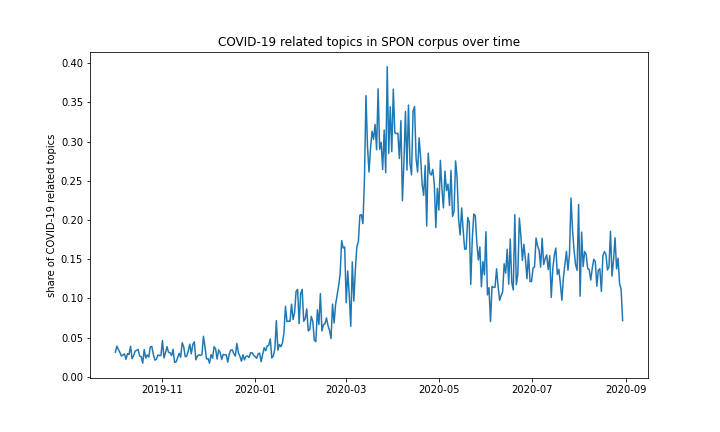

# Spiegel Online news topics and COVID-19 – a topic modeling approach

Markus Konrad <markus.konrad@wzb.eu>, November 2020

This is a small project to showcase topic modeling with the [tmtoolkit Python package](https://tmtoolkit.readthedocs.io/), where I use a corpus of articles from the German online news website *[Spiegel Online (SPON)](https://www.spiegel.de/)*  to create a topic model for before and during the COVID-19 pandemic. This topic model is then used to analyze the volume of media coverage regarding the pandemic and how it changed over time. Currently, a time span from Oct. 2019 to end of Aug. 2020 is covered but I plan to give an update for a time span until end of Nov. 2020.

## Analysis notebook and scripts

**The main analysis is done in the notebook [`tm_analysis.ipynb`](https://wzbsocialsciencecenter.github.io/tm_corona/tm_analysis.html). Head over there for an application of topic models.** However, data retrieval, preparation and topic modeling is just as important and is done in the following scripts: 

1. scraping news from SPON: [`fetch_news/spon.py`](fetch_news/spon.py)
2. text data preparation for topic modeling with *tmtoolkit*: [`prepare.py`](prepare.py)
3. topic model evaluation with *tmtoolkit*: [`tm_evaluation.py`](tm_evaluation.py)
4. generation of final candidate topic models with *tmtoolkit*: [`tm_final.py`](tm_final.py)

## Data

Most raw data files are too big for git. I provide the document-term matrix, corpus metadata and generated topic models as separate ZIP file for download:

http://dsspace.wzb.eu/tm_corona_data.zip

Simply unzip the file to the cloned repository folder. You may contact me for access to the raw text data.

## License

Licensed under [Apache License 2.0](https://www.apache.org/licenses/LICENSE-2.0). See `LICENSE` file. 
